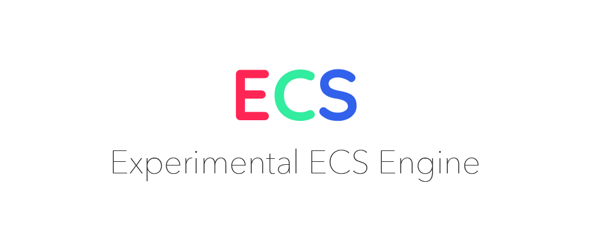

<p align="center">
  
</p>
<hr/>

**ECS** is a experimental Entity Component System. Etc...

## Features

- 3D Rendering (ThreeJS)
- 2D Rendering (PixiJS)
- Sounds (HowlerJS)
- UDP Networking (Geckos)
- TCP Networking (uWebsockets)
- Snapshot Interpolation
- Physics (MatterJS, CannonJS, AmmoJS & PhysX)
- Gamepad Input
- React UI

## Getting started

```
git clone git@github.com:Milkshake-Inc/ecs.git
yarn
yarn start
```


## Resources

# useCouple
# useEntity
# useEvents
# useQueries
# useState

 - [ECS Architecture](https://ecsy.io/docs/#/manual/Architecture)
 - [Unity Tiny](https://docs.unity3d.com/Packages/com.unity.tiny@0.15/manual/module-core2d.html)
